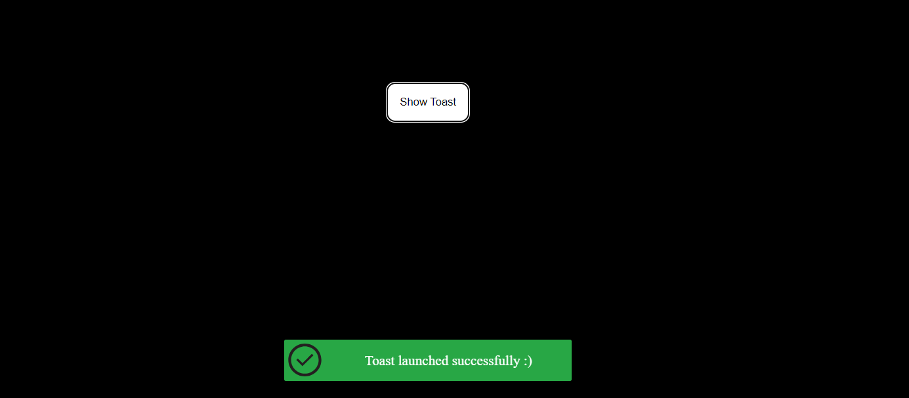

# Getting Started with ReactAnimatedToast

This project helps you create beautiful animated Toast messages in your react app

## Appearance


## Usage
### Import the component into your project
```javascript
import AnimatedToast from './Components/AnimatedToast/AnimatedToast.jsx';
```

### Create a ref in parent component that you want to add AnimatedToast
```javascript
constructor(props) {
  super(props);
  this.toastRef = React.createRef();
}
```

### Add AnimatedToast component inside the parent component and pass the ref parameter
```javascript
export default class ParentComponent extends Component {
  constructor(props) {
    super(props);
    this.toastRef = React.createRef();
  }

  render() {
    return (
      <div className="parent">
        <AnimatedToast type="success" imgAlt="testAlt" message="Input Data is incorrect" ref={this.toastRef} />
      </div>
    )
  }
}
```

### Call launch_toast method whenever you want using toastRef
For example in example below the toast message will be shown when button is clicked
```javascript
<button onClick={e => this.toastRef.current.launch_toast("Toast message text")}>Show Toast</button>
```
As you can see you must pass a string as toast message in launch_toast method.